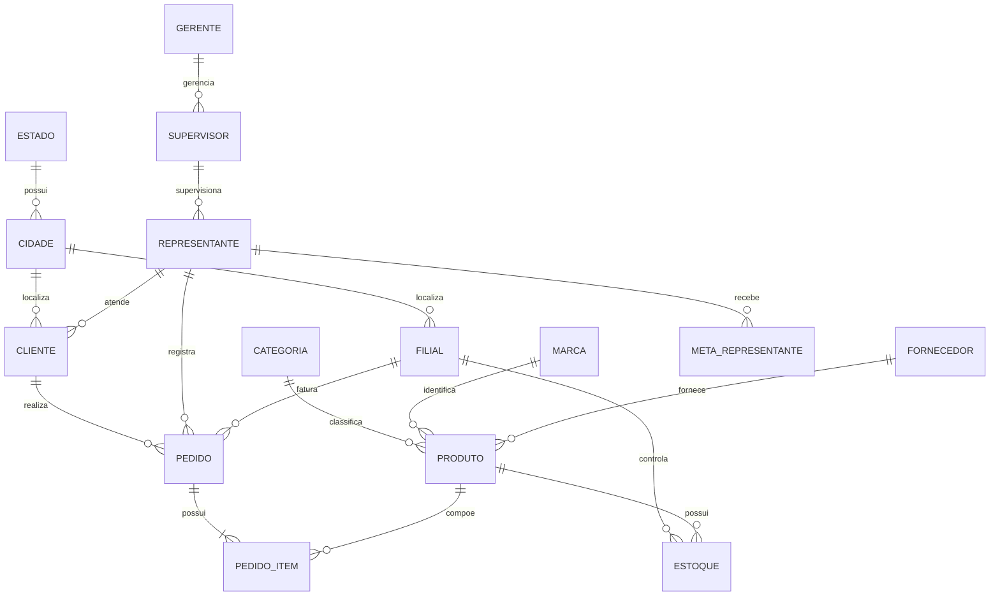

# Documento Técnico 02 — Modelagem Relacional

> **Projeto:** Atlas Distribuidora Analytics  
> **Banco:** MySQL 8+  
> **Modelo:** Relacional normalizado  
> **Status:** Versão 1.0

## 1. Objetivo

Representar a operação da Atlas Distribuidora em um banco relacional capaz de sustentar clientes, produtos, estrutura comercial, pedidos, estoque e metas.

## 2. Entidades

### Geografia e operação

- `estado`
- `cidade`
- `filial`

### Estrutura comercial

- `gerente`
- `supervisor`
- `representante`

### Clientes

- `cliente`

### Produtos e suprimentos

- `categoria`
- `marca`
- `fornecedor`
- `produto`

### Vendas

- `pedido`
- `pedido_item`

### Estoque

- `estoque`

### Metas

- `meta_representante`

## 3. Diagrama lógico

## 4. Cardinalidades principais

| Origem | Relação | Destino |
|---|---|---|
| Estado | 1:N | Cidade |
| Cidade | 1:N | Cliente |
| Cidade | 1:N | Filial |
| Gerente | 1:N | Supervisor |
| Supervisor | 1:N | Representante |
| Representante | 1:N | Cliente |
| Cliente | 1:N | Pedido |
| Filial | 1:N | Pedido |
| Representante | 1:N | Pedido |
| Pedido | 1:N | Pedido Item |
| Produto | 1:N | Pedido Item |
| Categoria | 1:N | Produto |
| Marca | 1:N | Produto |
| Fornecedor | 1:N | Produto |
| Produto + Filial | 1:1 lógico | Estoque |
| Representante | 1:N | Meta mensal |

## 5. Decisões de modelagem

### Cliente e representante

Cada cliente referencia um único representante, atendendo às regras RN004 e RN005.

### Produto

Categoria, marca e fornecedor são entidades próprias para evitar repetição textual e permitir análises por esses atributos.

### Pedido e item

O cabeçalho do pedido armazena informações gerais da venda. Os produtos ficam em `pedido_item`, permitindo múltiplos itens por pedido.

### Preço histórico

`pedido_item.preco_unitario` registra o preço praticado na venda. O valor não depende do preço atual cadastrado no produto.

### Custo histórico

`pedido_item.custo_unitario` permite calcular margem histórica mesmo que o custo atual do produto seja alterado posteriormente.

### Estoque por filial

A combinação `id_filial + id_produto` é única, pois cada filial mantém saldo próprio para cada produto.

### Metas

A meta é cadastrada por representante e competência mensal. A meta do supervisor deve ser calculada pela soma das metas da equipe, evitando redundância.

## 6. Regras de integridade

- códigos de negócio relevantes são únicos;
- quantidades não podem ser negativas;
- preço e custo não podem ser negativos;
- produtos inativos permanecem no histórico;
- pedidos cancelados são mantidos para rastreabilidade, mas excluídos de indicadores;
- estoque mínimo não pode ser maior que estoque máximo;
- cada representante possui no máximo uma meta por competência.

## 7. Granularidade operacional

| Tabela | Grão |
|---|---|
| cliente | um registro por cliente |
| produto | um registro por produto |
| pedido | um registro por pedido |
| pedido_item | um registro por produto dentro do pedido |
| estoque | um registro por produto e filial |
| meta_representante | um registro por representante e mês |

## 8. Arquivo de implementação

A definição física do modelo está disponível em:

`sql/01_schema_operacional.sql`
