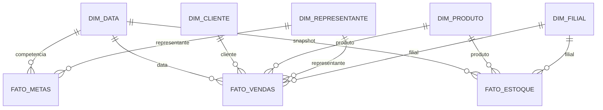

# Documento Técnico 04 — Modelo Dimensional

> **Projeto:** Atlas Distribuidora Analytics  
> **Objetivo:** Camada analítica para Power BI  
> **Abordagem:** Esquema estrela

## 1. Por que um modelo dimensional?

O banco operacional foi criado para registrar a operação com integridade. Para análise, o objetivo muda: consultas precisam ser simples, rápidas e orientadas a métricas.

Por isso, o projeto adota uma camada dimensional específica para BI.

## 2. Fato Vendas

### Grão

**Uma linha por item de pedido faturado.**

### Chaves

- data do faturamento;
- cliente;
- produto;
- representante;
- filial;
- número do pedido como dimensão degenerada.

### Métricas

- quantidade;
- valor bruto;
- desconto;
- faturamento líquido;
- custo;
- margem bruta.

```text
Margem Bruta = Faturamento Líquido - Custo
```

## 3. Fato Metas

### Grão

**Uma linha por representante e competência mensal.**

### Métrica

- valor da meta.

O atingimento deve ser calculado no modelo semântico:

```text
Atingimento % = Faturamento / Meta
```

## 4. Fato Estoque

### Grão proposto

**Uma linha por produto, filial e data de snapshot.**

Esse formato permite analisar evolução histórica do estoque, e não apenas o saldo atual.

### Métricas

- estoque atual;
- estoque mínimo;
- estoque máximo;
- valor estimado em estoque.

## 5. Dimensões

### dim_data

Atributos:

- data;
- dia;
- mês;
- nome do mês;
- trimestre;
- ano;
- ano-mês;
- dia da semana.

### dim_cliente

Atributos:

- código do cliente;
- razão social;
- nome fantasia;
- status cadastral;
- cidade;
- estado;
- UF.

### dim_produto

Atributos:

- SKU;
- descrição;
- categoria;
- marca;
- fornecedor;
- status do produto.

### dim_representante

Atributos:

- código;
- representante;
- supervisor;
- gerente;
- status do representante.

A hierarquia comercial permanece desnormalizada na dimensão para facilitar filtros e drill-down.

### dim_filial

Atributos:

- código;
- filial;
- cidade;
- estado;
- UF.

## 6. Diagrama estrela de vendas



## 7. KPIs derivados

### Faturamento

Somatório do valor líquido de itens pertencentes a pedidos faturados.

### Ticket médio

```text
Faturamento / quantidade distinta de pedidos
```

### Margem bruta

```text
Faturamento líquido - custo dos itens
```

### Margem %

```text
Margem bruta / faturamento líquido
```

### Atingimento da meta

```text
Faturamento / meta
```

### Clientes compradores

Quantidade distinta de clientes com faturamento no contexto analisado.

### Cliente inativo

Cliente cuja última compra faturada ocorreu há mais de 90 dias em relação à data de referência.

### Estoque abaixo do mínimo

Produto/filial em que:

```text
estoque_atual < estoque_minimo
```

## 8. Cuidados no Power BI

- relações preferencialmente 1:N, da dimensão para a fato;
- direção de filtro simples sempre que possível;
- tabela calendário marcada como tabela de datas;
- medidas em vez de colunas calculadas para indicadores agregáveis;
- ocultar chaves técnicas do usuário final;
- não relacionar fatos diretamente entre si.

## 9. Próximo passo

Implementar a carga das dimensões e fatos a partir do banco operacional e documentar as medidas DAX utilizadas no dashboard.
